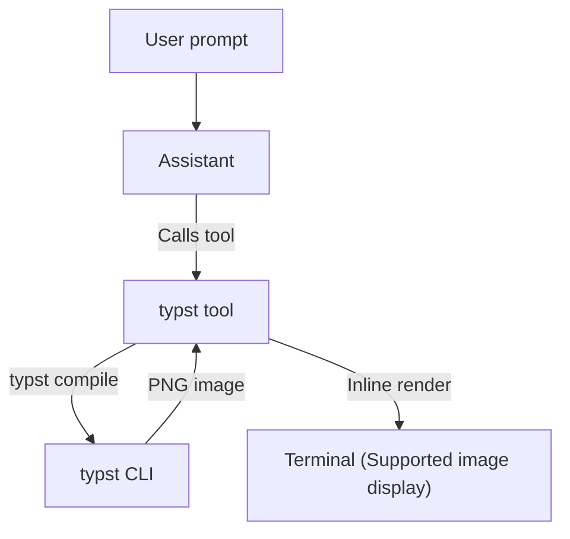

# pi-typst

`pi-typst` is a Pi extension that renders Typst into terminal images.

## Concept

## Architecture & Principles

- **Official Extension Contract**: Integrate cleanly through Pi's custom tool mechanism rather than monkey-patching internal TUI rendering.
- **Rely on Local CLI**: Delegate rendering to the local `typst` CLI. Typst provides fast, standalone compilation with clear diagnostics.
- **Natural Agent Experience**: Do not impose proprietary syntax or complex protocols on the model. The agent writes standard Typst, using compiler diagnostics for self-correction.
- **Terminal-Friendly Presentation**: Respect modern terminal environments (predominantly dark backgrounds) by ensuring rendered outputs avoid harsh contrast glare.

## Development

- **Prerequisites**: Ensure the `typst` CLI is installed and available in `$PATH`.
- **Manual Testing**: Run `pi -e .` to load and test the extension interactively in Pi.

